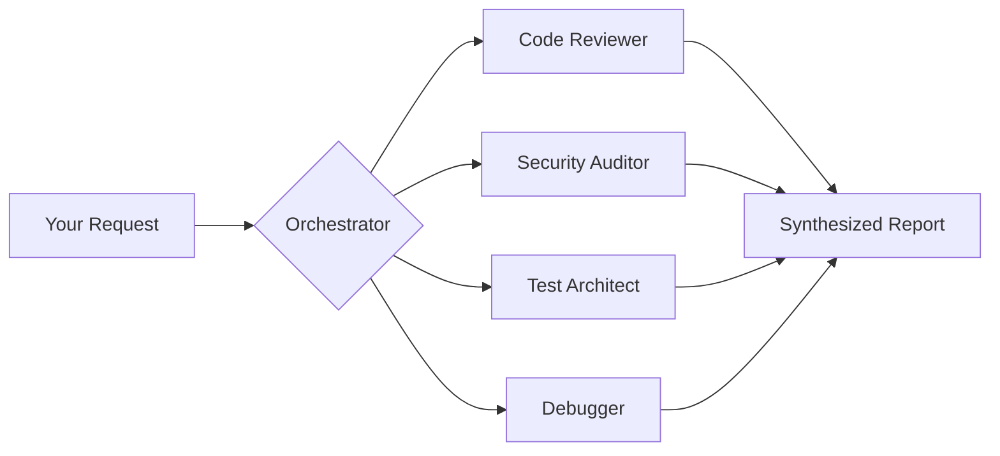

# 🚀 OpenCode Workflow

[](https://opensource.org/licenses/MIT)
[]()
[](https://opencode.ai)

**OpenCode Workflow** is a high-performance, specialized automation suite designed to supercharge your development process. It provides a coordinated ecosystem of intelligent agents, expert skills, and surgical commands to handle everything from architectural design to security auditing—all within your CLI.

---

## 🌟 Key Features

| Component                 | Stats  | Description                                                          |
| :------------------------ | :----: | :------------------------------------------------------------------- |
| **🤖 Specialized Agents** | **7**  | An Orchestrator plus 6 expert agents (Security, Tests, Docs, etc.)   |
| **⌨️ Custom Commands**    | **12** | One-tap workflows like `/review`, `/commit`, `/architect`, and more. |
| **🧠 Domain Skills**      | **7**  | Deep knowledge bases for APIs, Performance, and Architecture.        |
| **🔌 Smart Plugins**      | **5**  | Automated guardrails: formatting, security scans, and notifications. |

### ⚡ Parallel Execution Engine

Traditional workflows are sequential. OpenCode is built for **speed**.



> **Pro Tip:** Independent tasks run simultaneously. Five 30-second reviews take 30 seconds total, not 2.5 minutes.

---

## 📥 Installation

OpenCode looks for workflow files in a hidden `.opencode/` directory within your project.

### 1. Clone the Source

```bash
git clone https://github.com/0xd33p/opencode-workflow.git
cd opencode-workflow
```

### 2. Setup Your Project

Map the repository folders to the standard OpenCode structure:

```bash
# Create target directory
mkdir -p your-project/.opencode

# Copy components to their standard locations
cp -r agents/   your-project/.opencode/agent
cp -r commands/ your-project/.opencode/command
cp -r skills/   your-project/.opencode/skill
cp -r plugins/  your-project/.opencode/plugin
```

### 🗺️ Folder Mapping Reference

| Source Folder | Destination Folder   |
| :------------ | :------------------- |
| `agents/`     | `.opencode/agent/`   |
| `commands/`   | `.opencode/command/` |
| `skills/`     | `.opencode/skill/`   |
| `plugins/`    | `.opencode/plugin/`  |

---

## 🛠️ Usage Guide

### 🎭 Primary Agents

Press **`Tab`** to cycle through the heavy-lifters:

- **`build`**: Your everyday companion for full development work.
- **`plan`**: For analysis and strategy (Read-only mode).
- **`orchestrator`**: Coordinates complex, multi-step operations.

### 👥 The Specialist Squad

Invoke experts using **`@mention`** for surgical precision:

| Subagent            | Mandate                    | Capabilities |
| :------------------ | :------------------------- | :----------: |
| `@code-reviewer`    | Patterns & Maintainability |   🔍 Read    |
| `@debugger`         | Root cause investigation   |   💻 Bash    |
| `@security-auditor` | OWASP & Vulnerabilities    |   🛡️ Audit   |
| `@refactorer`       | Clean code & Design        |   ✍️ Edit    |
| `@test-architect`   | Strategy & Coverage        |   ✅ Test    |
| `@docs-writer`      | READMEs & Documentation    |   📝 Write   |

### ⚡ Power Commands

Trigger complex workflows using **`/`**:

- `/review` — Multi-perspective deep dive.
- `/commit` — AI-powered conventional commits.
- `/architect` — High-level system design.
- `/verify-changes` — Full CI pipeline: `Lint → Type → Build → Test → Review`.
- `/rapid` — Minimum ceremony, maximum speed.

---

## 🧠 Core Philosophy

### 🏗️ The Orchestrator Pattern

Instead of a "Jack of all trades," we use a master coordinator:
`UNDERSTAND ➔ PLAN ➔ DELEGATE ➔ INTEGRATE ➔ VERIFY ➔ DELIVER`

### ⚔️ Adversarial Verification

Why rely on one opinion? Our agents challenge each other:

- **Security Auditor:** "How can I break this?"
- **Code Reviewer:** "Is this clean and maintainable?"
- **Test Architect:** "Is this actually verified?"

### 🛡️ Guardrails Without Friction

Plugins work in the background to keep you safe:

- **Security Scan:** Blocks leaks of `.env` or API keys.
- **Auto-Format:** Runs Prettier/Black automatically.
- **Parallel Guard:** Optimizes multi-agent performance.

---

## 🔧 Customization

Adding your own logic is as simple as creating a Markdown file:

- **New Agent:** Add to `.opencode/agent/my-agent.md`.
- **New Command:** Add to `.opencode/command/my-cmd.md`.
- **New Skill:** Add a folder to `.opencode/skill/my-skill/SKILL.md`.

---

## ❓ Troubleshooting

- **No Tab Suggestions?** Ensure folders are singular (e.g., `agent/`, not `agents/`).
- **Commands missing?** Check `.opencode/command/` for the `.md` files.
- **Skills not loading?** Each skill requires its own subfolder with a `SKILL.md` file.

---

## 🤝 Credits & License

Inspired by [claude-workflow-v2](https://github.com/CloudAI-X/claude-workflow-v2). Built for [OpenCode CLI](https://opencode.ai).

Developed by [@0xd33p](https://github.com/0xd33p). Original inspiration from [@cloudxdev](https://x.com/cloudxdev).

**License:** [MIT](LICENSE)
